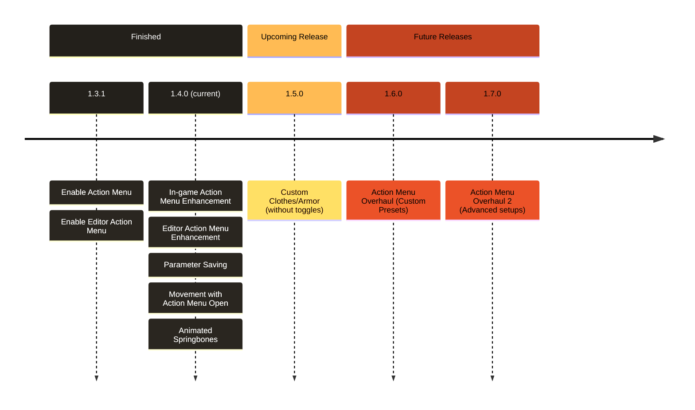

# ValheimPlayerModels - Revamps

> [!NOTE]
> Installation instructions listed below.

## Latest files (1.4.0)

| File | Download |
|----------:|----|
| **Plugin (mod)** |  |
| **Unity SDK** |  | 

## About ValheimPlayerModels - Revamps
**ValheimPlayerModels - Revamps** is a project based on the [ValheimPlayerModels mod](https://github.com/dresklaw/ValheimPlayerModels) by [Ikeiwa](https://github.com/ikeiwa/) and maintained by [Dresklaw](https://github.com/dresklaw). 
The goal of this project is not to maintain, but expand upon the mod by enabling and enhancing the unfinished inclusion of the animator and Action Menu.

https://github.com/user-attachments/assets/ec621e59-46fc-4d71-a128-08a964777287

Interested in this project? ***Check out the [Roadmap](#roadmap) down below!***

## How to install

> 1. Download and install the [BepInEx package](https://valheim.thunderstore.io/package/denikson/BepInExPack_Valheim/)
> 2. Drag and drop [ValheimPlayerModels.dll](https://github.com/Burrely/ValheimPlayerModels-Revamps/releases/download/1.4.0/ValheimPlayerModels.dll) in the "BepInEx/plugin" folder in your game install folder
> 3. Launch the game
> 4. Place all your avatars in the newly created "PlayerModels" folder inside your game install folder
> 5. The mod will load the avatar with the same filename as your character name (you might want to restart the game)

## How to create an avatar

> 1. Install [Unity 2022.3.50f1](https://unity.com/releases/editor/whats-new/2022.3.50)(, versions of 2022 preceding 2022.3.50f1 work too, e.g. 2022.3.22)
> 2. Create a new 3D Project
> 3. [Download the SDK](https://github.com/Burrely/ValheimPlayerModels-Revamps/releases/download/1.4.0/ValheimPlayerModels_SDK_1.4.0.unitypackage)
> 4. Import the SDK and all your avatar assets
> 5. Change your avatar model rig to Humanoid
> 6. Place your avatar model in the scene
> 7. Add a "Valheim Avatar Descriptor" component on your avatar
> 8. Click the "Auto-Setup" Button
> 9. Move the different equipment previews how you like
> 10. Set the material shaders to **Standard**, this allows you to create smoothness/metallic maps instead of being limited to a slider.
> 11. Click the "Export" button in the Avatar Descriptor
> 12. Export in the "PlayerModels" folder in your game install folder

## Roadmap

